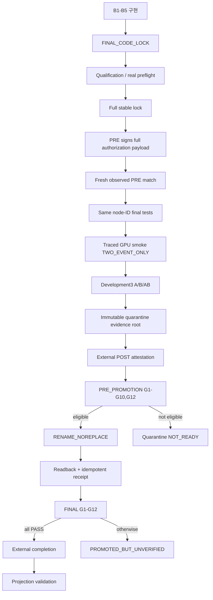

# CF1S Development3 재실행 및 다중 이벤트 편집 모듈 검증 수행계획서

| 항목 | 값 |
|------|-----|
| 문서 종류 | 정본 수행계획서 (`APPROVED FOR IMPLEMENTATION`) |
| 초안 보존 | `reports/cf1s/CF1S_Development3_재실행_및_다중이벤트_편집모듈_검증계획_초안.md` (수정하지 않음) |
| HOLD 근거 | `reports/cf1s/CF1S_DEV3_CONTRACT_HOLD_20260719T074940Z/` |
| 잠정 evidence | `20260719T064717Z` (수치 비교용만, 최종 승인 금지) |
| 승인 상태 | `APPROVED FOR IMPLEMENTATION` |

---

## 1. 목적

본 계획의 목적은 CF-1S **2-event** 다중 이벤트 편집 경로가 실제 GPU production 실행에서 계약대로 작동하는지 다시 검증하고, Development3의 **실제 FINAL verifier G1–G12 PASS** 이후에만 Validation20 → Primary32(Train32 remainder) 결과 추출로 확장할 수 있는 상태를 만드는 것이다.

이번 작업은 기존 `20260719T064717Z`의 수치 결과를 재승인하는 작업이 아니다. 기존 결과는 디버깅 비교용 잠정 evidence로만 보존하고, **B1–B5 + verifier lifecycle**이 교정된 코드와 **새 run ID**에서 생성된 evidence를 기준으로 판정한다.

과학적 정책·threshold·후보 생성 방식은 변경하지 않는다. 현행 threshold는 Development3 Search baseline calibration(`DEVELOPMENT3_SEARCH_BASELINE_REPEATS_ONLY`)을 유지한다.

---

## 2. 구현 전 공식 판정 (고정)

```text
development_execution_readiness = NOT_READY
development_evaluation_coverage = UNVERIFIED
development_scientific_result = PROVISIONAL_NOT_SUPPORTED × 3
highest_claim_level = NONE
55-case expansion = HOLD

Development3 numeric observation: 잠정 delta 존재
Development3 numeric replication status: UNVERIFIED
Development3 final contract verification: FAIL
```

기존 실행은 계약이 검증되지 않았으므로 “재현”으로 판정하지 않는다. 기존 delta가 두 실행에서 비슷했다는 사실은 old/new comparison artifact에서만 다루고, 새 계약 실행의 FINAL PASS 전에는 replication 주장을 하지 않는다.

재실행에서 material 후보 없이 control만 확인되면 최종 scientific 결과는 원칙적으로 **`NOT_EVALUATED ×3`** 와 별도의 `control_result`이며, 이를 `NOT_SUPPORTED ×3`로 보고하지 않는다. 현재의 `PROVISIONAL_NOT_SUPPORTED ×3`는 과거 오판을 포함한 잠정 기록이다.

---

## 3. 범위

### 3.1 실제 실행 범위

```text
cohort: Development3
execution_scope: TWO_EVENT_ONLY
actual family: A / B / AB
three_event_execution_status: OUT_OF_SCOPE (contract test only)
```

### 3.2 비범위

- Train35/Validation20 전체 GPU 실행 (Development3 FINAL PASS 전)
- 3-event ABC 실제 효과 검증
- 독립 holdout·인과 개입 효과·농작업 추천 주장
- threshold / candidate policy / scientific rule의 성능 개선
- verifier 전용 signing key 도입 (“signed verdict” 경로)

### 3.3 cohort 정규화

| 실행 단위 | Case | 용도 |
|-----------|-----:|------|
| Development3 | 3 | 계약·calibration·재검증 |
| Validation20 | 20 | fine-tune 미사용 평가 (Problem20을 자동 동일시하지 않음) |
| Primary32 | 32 | training-seen diagnostic |
| Train35 | 35 | Dev3∪Primary32 **합산 보고만** (package pooling 금지) |

---

## 4. 기존 evidence 보존

1. 기존 evidence 디렉터리, ZIP, receipt, completion, verdict를 수정·삭제·덮어쓰기하지 않는다.
2. `EVIDENCE_LINEAGE.json`에 `INVALIDATED_FOR_FINAL_CLAIM` / `DEBUGGING_AND_DELTA_COMPARISON`을 유지한다.
3. 새 실행은 충돌 불가능한 run ID와 새 quarantine 경로를 사용한다.
4. 동일 run ID 또는 final 경로가 이미 존재하면 삭제·대체하지 않고 fail-closed한다.
5. 새 run이 최종 승격된 후에만 외부 lineage update artifact로 `superseded_by`를 갱신한다.

---

## 5. 조사로 확정한 재발 방지 전제

| ID | 관측 | 영향 |
|----|------|------|
| B1 | completion은 G1–G12 PASS를 주장했으나 verifier는 G5/G7/G10/G11만 PASS, 나머지 `NOT_RUN`. 저장소에 재현 가능한 completion 생성기 없음 | 허위 READY/COMPLETE |
| B2 | PRE qualification SHA 3개 null, PRE auth가 일부 lock만 서명, boolean-only preflight | G5 허위 PASS |
| B3 | IxG/Stage-A/critic 실제 loader에 global trace 미연결, `ATTRIBUTION_FORWARD` 부재, load→forward count 오매핑 | G3 허위/미검증 |
| B4 | selected AB `parent_transaction_shas=[]` (`_ledger_row` 인자는 있으나 호출부 미전달) | G7 허위 PASS |
| B5 | Fold2 logit은 forward 결과에 있으나 ledger projection에서 소실 | G4/G8/G9 재계산 불가 |
| Sci | control-only를 `NOT_SUPPORTED`로 보고 | scientific 오판 |

---

## 6. 권위 체계와 artifact 경계

### 6.1 유일한 판정 권위

- G1–G12의 유일한 권위 원천은 **public-key-only verifier**가 생성한 **결정적 unsigned canonical verdict**다.
- 실행기 summary, attestation READY, pytest notes, 수동 completion은 판정 근거가 될 수 없다.
- verifier는 signing key를 보유하지 않는다. 서명된 PRE/POST artifact를 trust-root **public key**로 검증한 뒤 immutable evidence에서 verdict와 `verdict_sha256`을 생성한다.
- “signed verdict” 표현과 verifier 전용 key는 범위에서 제외한다.

### 6.2 quarantine root vs 외부 sidecar

| 위치 | 포함 |
|------|------|
| evidence root (package 내부) | 실행 원자료, trace, ledger, lock manifest, candidate/case artifacts |
| package 밖 (sidecar) | PRE/POST signature, PRE_PROMOTION verdict, FINAL verdict, receipt, completion, projection validation |

규칙:

- 모든 외부 artifact는 동일한 `run_id + evidence_root_sha256`을 참조한다.
- immutable root SHA 계산 이후 package 내부 쓰기를 금지한다.
- attestation/verdict를 package 안에 써 evidence root를 바꾸는 경로를 금지한다.
- verifier는 package 내부 파일을 생성·수정하지 않는 **read-only** 프로세스다.

### 6.3 completion (외부 projection)

경로: `outputs/cf1s_core/completions/<run_id>.json`

- FINAL verdict의 `source_verdict_sha256`, gate-map SHA, evidence root SHA, receipt SHA를 복사만 한다.
- final package/evidence root에 completion을 다시 포함하지 않는다.
- projection validator는 외부 배포 조건으로만 참조 동등성을 검사한다 (G1–G12에 포함 금지 → 자기참조 방지).
- FINAL에 `PASS` 외 상태가 하나라도 있으면 completion 미발급, READY/COMPLETE 금지.

발급 조건:

```text
FINAL G1–G12 == PASS
final evidence_root == receipt evidence_root
final receipt_sha == actual receipt SHA
completion.source_verdict_sha == final verdict_sha
completion.gate_map_sha == verdict gate-map SHA
```

---

## 7. 2단계 verifier lifecycle

### 7.1 순서

```text
B1–B5 구현
→ FINAL_CODE_LOCK
→ qualification tests / real preflight
→ full stable PRE lock
→ PRE authorization (full payload 서명)
→ fresh observed lock verification
→ same-node-ID final tests
→ traced GPU smoke (TWO_EVENT_ONLY)
→ Development3 A/B/AB
→ immutable quarantine evidence root
→ external POST attestation (full payload 서명)
→ public-key-only PRE_PROMOTION verifier (G1–G10, G12)
→ eligible이면 atomic RENAME_NOREPLACE promotion
→ immutable readback
→ idempotent external receipt
→ public-key-only FINAL verifier (G1–G12)
→ external completion projection
→ completion projection validation
→ Development3 GO/HOLD
```



### 7.2 Gate ownership 표

| Gate | Phase | 핵심 입력 | 판정 주체 |
|------|-------|-----------|-----------|
| G1 Transaction | PRE_PROMOTION | typed TX, Gate0/4, canonical atomic/TX chain | `core_verifier` |
| G2 Runtime | PRE_PROMOTION | cold rebuild, batch parity, Stage-A/critic pairing | `core_verifier` |
| G3 Trace | PRE_PROMOTION | persisted trace hash chain, load/forward counts | `core_verifier` |
| G4 Evidence | PRE_PROMOTION | ledger completeness, summary 재계산 | `core_verifier` |
| G5 Authorization | PRE_PROMOTION | PRE/POST payload, full stable lock, PRE–POST link | `core_verifier` |
| G6 Selection | PRE_PROMOTION | Search fold material/control/mixed, deterministic selection | `core_verifier` |
| G7 Closure | PRE_PROMOTION | exact A/B parent TX linkage | `core_verifier` |
| G8 Re-evaluation | PRE_PROMOTION | frozen Fold2 replay, pre-closure side-effect 0 | `core_verifier` |
| G9 Scientific | PRE_PROMOTION | ledger-derived control/material/incremental (semantics §11) | `core_verifier` |
| G10 Attestation | PRE_PROMOTION | evidence root, detached POST signature, public-key-only verify | `core_verifier` |
| G11 Promotion | POST_PROMOTION | RENAME_NOREPLACE, readback, external receipt | FINAL `core_verifier` |
| G12 Lifecycle | PRE_PROMOTION | FINAL_CODE_LOCK 이후 same-node-ID qualification/test/GPU/Dev3 | `core_verifier` |

허용 상태: `PASS | FAIL | BLOCKED_BY_Gx | NOT_RUN` 외 금지.

### 7.3 G11 schema 규칙

```text
promotion_eligible=true  → PRE_PROMOTION G11 = NOT_RUN
promotion_eligible=false → PRE_PROMOTION G11 = BLOCKED_BY_<first_failed_gate>
FINAL verifier           → G11 = PASS | FAIL
```

- PRE_PROMOTION은 전체 성공 verdict가 아니라 `promotion_eligible` 판정이다.
- G1–G10/G12가 모두 PASS일 때만 `promotion_eligible=true`.
- 하나라도 실패하면 quarantine 유지, promotion 금지.
- FINAL은 PRE_PROMOTION verdict SHA 재검증, promotion 중 G1–G10/G12 입력 불변 확인 후 G11 평가.
- G11 실패 후 final package를 삭제·되돌리지 않는다: `PROMOTED_BUT_UNVERIFIED / NOT_READY / UNVERIFIED / highest_claim_level=NONE`.

### 7.4 Verdict schema (unsigned canonical)

```json
{
  "verdict_kind": "CF1S_FINAL_VERIFIER_VERDICT_V1",
  "verifier_phase": "PRE_PROMOTION | FINAL",
  "schema_version": "...",
  "verifier_code_sha256": "...",
  "run_id": "...",
  "evidence_root_sha256": "...",
  "receipt_sha": null,
  "promotion_eligible": true,
  "gate_results": {},
  "gate_map_sha256": "...",
  "verdict_sha256": "..."
}
```

- PRE_PROMOTION: `receipt_sha=null`, `promotion_eligible` 필수, G11=`NOT_RUN` 또는 `BLOCKED_BY_*`.
- FINAL: `receipt_sha` 필수, G1–G12 전부 평가.

orchestrator는 evidence만 생성한다. 선제 G5/G7/G10/G11 PASS 설정은 제거한다.

---

## 8. B1–B5 구현 계약

### B1. Verdict / completion 단일 권위

**대상 파일**

- 신규: `src/.../cf1s/core_verifier.py`
- 신규: `scripts/online2_v2/v03/complete_cf1s_run_v03.py`
- `core_orchestrator.py` (선제 gate PASS 제거)
- `run_cf1s_core_development_production_v03.py` (execution-finished vs final-success exit 분리)
- `core_promotion.py` (승격 primitive)

**변경**

1. PRE_PROMOTION/FINAL 두 phase를 원자료에서만 결정적으로 평가한다.
2. completion은 FINAL verdict 투영만 수행한다.
3. `NOT_RUN|FAIL|BLOCKED_BY_Gx → PASS` 변환 금지.

**Acceptance (failure-injection)**

- G3=`NOT_RUN` fixture → completion 발급 실패
- gate map / run ID / evidence root mismatch → 거부
- 모든 gate PASS fixture에서만 completion 발급
- runner가 NOT_RUN gate로 exit 0 + READY를 출력하지 않음

---

### B2. Full stable lock + PRE/POST full payload 서명

**대상 파일**

- `core_locks.py` — `validate_stable_lock_manifest()`, 필수 SHA schema
- `core_authorization.py` — full payload 서명/검증
- `authorize_cf1s_development_smoke.py` — partial lock·boolean preflight 폐기
- `core_preflight.py` — 실측 관측값 저장
- `core_orchestrator.py` — fresh observed lock만 비교, auth self-reference expected 거부

**필수 stable lock 필드 (non-null 64-hex)**

```text
code_tree_sha256, test_tree_sha256, policy_tree_sha256
qualification_test_log_sha256, qualification_preflight_sha256, qualification_node_id_manifest_sha256
development_manifest_sha256, case_input_manifest_root_sha256, fold_routing_sha256
stage_a_checkpoint_manifest_sha256, critic_checkpoint_manifest_sha256
tokenizer_sha256, vocab_sha256, feature_schema_sha256
binning_registry_sha256, label_map_sha256
deterministic_runtime_policy_sha256, risk_head_contract_sha256
Dev3 calibration artifact SHA, execution_scope=TWO_EVENT_ONLY
```

**PRE authorization payload (digest 단독 서명 금지)**

```text
schema/version
authorization type
run ID, cohort ID
scope: DEVELOPMENT3, TWO_EVENT_ONLY
stable_lock_sha256
issuer / key ID
발급·만료시각
허용 실행 종류
Primary32 / Validation20 / recommendation 권한 = false
```

**POST attestation payload (digest 단독 서명 금지)**

```text
run / cohort / scope
PRE authorization SHA
PRE stable-lock SHA
freshly computed POST stable-lock SHA
evidence-root SHA
final_rerun_observation_manifest_sha256 (evidence root에 포함되지 않은 경우)
intended final destination
issuer / key ID, 발급시각
```

PRE–POST link, stable lock 또는 evidence root가 다르면 `promotion_eligible=false`.

**Qualification vs final-rerun artifact 결합 (소급 삽입 금지)**

PRE authorization 이후 수행되는 `same-node-ID final tests`의 artifact SHA는 PRE stable lock에 소급 삽입하지 않는다. 그러면 PRE 서명 대상이 변경되기 때문이다. 기록 위치를 다음처럼 분리한다.

| Artifact | 기록 위치 |
|----------|-----------|
| `qualification_test_log_sha256` | PRE stable lock (authorization 이전 생성) |
| `qualification_node_id_manifest_sha256` | PRE stable lock (authorization 이전 생성) |
| `final_rerun_test_log_sha256` | 실행 evidence / POST sidecar |
| `final_rerun_node_id_manifest_sha256` | 실행 evidence / POST sidecar |
| `final_rerun_observation_manifest_sha256` | 실행 evidence / POST sidecar |

- G12는 qualification과 final rerun의 node-ID 집합·test selection 동등성을 검증한다.
- POST attestation은 final-rerun artifact를 evidence root 또는 별도 observation manifest SHA를 통해 결합한다.

**실제 preflight**: cold rebuild, batch parity, Stage-A–critic pairing, fold isolation, deterministic runtime, risk–logit. 각 항목은 대상 SHA, 관측값, tolerance, PASS/FAIL, producer code SHA를 포함한다. boolean-only/placeholder 거부.

**Acceptance**

- qualification null/placeholder/비-64hex → 발급 실패
- digest-only PRE/POST → 거부
- auth self-reference expected → 거부
- code/policy/checkpoint/input drift → 소비 실패
- POST mismatch → attestation·promotion 차단
- qualification vs final test node-ID manifest mismatch → G12 FAIL

---

### B3. 실제 IxG / Stage-A / critic load·forward trace

**대상 파일**

- `core_trace.py` — `ATTRIBUTION_FORWARD` 추가, `to_forward_counts()` load→forward 오매핑 수정, persisted chain 검증
- `core_candidates.compute_search_event_preselect` — trace 주입
- `core_runtime.build_stage_a_reencoder` — STAGE_A_LOAD
- `core_production.make_production_fold_forward_fn` / `load_fold_model_v03` — CRITIC_LOAD와 CHECKPOINT_FORWARD 분리
- orchestrator — 단일 global writer를 모든 adapter에 주입

**상태 전이 (보존 필수)**

```text
REQUESTED → ALLOWED → STARTED → COMPLETED | FAILED
         → DENIED   (side effect 전, 이후 STARTED/COMPLETED 금지)
```

`COMPLETED > 0`만으로 중간 실패를 숨기지 않는다. 필수 logical operation에 `FAILED`가 있고 동일 operation identity의 허용 재시도가 `COMPLETED`로 종결됐다는 lineage가 없으면 **G3 FAIL**.

**Development3 필수 nonzero (`COMPLETED > 0`)**

```text
ATTRIBUTION_MODEL_LOAD
ATTRIBUTION_FORWARD
STAGE_A_LOAD
CRITIC_LOAD
CHECKPOINT_FORWARD
PIPELINE_INVOCATION
```

**필수 zero**

```text
Fold2 attribution load/forward
Fold2 critic load before closure
Fold2 candidate forward before closure
nonrequested fold load/forward
broken_trace_chain_count
```

Stage-A cache를 고려해 invocation 대비 고정 횟수는 강제하지 않는다. nonzero·pairing·phase 적합성만 검증한다.

**Acceptance**

- 단일-case GPU smoke에서 6종 nonzero
- fold2 pre-closure → REQUESTED→DENIED, loader 호출 0
- missing/duplicate terminal, hash-chain break, summary count mismatch → 폐기
- FAILED without successful retry lineage → G3 FAIL

---

### B4. Exact parent transaction chain

**대상 파일**

- `core_orchestrator._ledger_row` 호출부 (약 687–703행) — `parent_transaction_shas` 실제 전달
- `core_candidates.py` — pair에 canonical 2-parent SHA 고정
- `core_raw_transaction.py` — `verify_exact_parent_transactions`
- closure / selection / verifier G7

**역할 disposition**

```text
A/B disposition = PARENT_OF_SELECTED
AB disposition  = SELECTED_MATERIAL | SELECTED_CONTROL_NO_MATERIAL
```

**불변식**

```text
set(AB.parent_transaction_shas)
  == set(A.transaction_sha, B.transaction_sha)
  == set(closure.required_parent_transaction_shas)

AB atomic set == exact union(A, B)
incremental parent SHA set == ledger parent SHA set
```

parent SHA는 canonical 정렬하며 **집합 동등성 + canonical order**를 모두 검증한다.

**Acceptance**

- selected AB parent SHA 정확히 2개
- B,A 제출 순서 변경 후에도 canonical order·bundle SHA 불변
- empty / wrong / duplicate / cross-case parent → G7 FAIL + `NOT_EVALUABLE`

---

### B5. Fold-complete ledger + observation median

**대상 파일**

- `core_orchestrator._ledger_row` — Fold2/baseline logit·checkpoint·input SHA·trace ref 보존
- `core_scientific.check_risk_logit_contract` — ledger-only verifier 경로에 연결
- baseline aggregation / `core_execution` observation 저장

**저장 필드 (Search 0/1, Fold2 2)**

```text
risk, abnormal_logit, delta_risk, delta_logit
checkpoint_sha256, semantic_critic_input_sha
trace_invocation_id, baseline_observation_id
```

**Observation median (필수)**

1. baseline repeat마다 `(risk, logit, trace_ref, critic_input_sha)`를 **하나의 observation**으로 저장한다.
2. median risk 순위에 해당하는 **실제 observation 한 행**을 canonical tie-break로 선택한다.
3. 그 행의 risk와 logit을 함께 baseline으로 사용한다.
4. independently aggregated median risk / median logit 조합을 **금지**한다.
5. 짝수 repeat에서도 중앙값 평균 대신 명시적 observation 선택 규칙을 사용한다.

**계약**

```text
abs(risk - sigmoid(abnormal_logit)) <= 1e-6
delta == candidate - matching-fold baseline
summary delta == ledger-derived delta
```

누락·cross-fold·mismatch → `NOT_EVALUABLE` + 관련 gate FAIL.

**Acceptance**

- Search/Fold2 baseline·candidate risk+logit 완전성
- selected bundle Fold2 logit 누락 fixture → `scientific_status=NOT_EVALUABLE` + 관련 evidence/scientific gate(G4/G8/G9) FAIL
- `NOT_EVALUATED`는 Fold2 실행이 정책적으로 시작되지 않았거나 선행 gate에서 차단된 경우에만 사용 (실행 후 ledger 누락에는 사용 금지)
- 독립 median risk/logit 조합 fixture → 거부
- ledger-only 재계산 ≡ case summary

---

### 승격: Linux RENAME_NOREPLACE

**대상**: `core_promotion.py`

실제 사용: Linux `renameat2(..., RENAME_NOREPLACE)` 또는 동일 filesystem의 동등한 원자적 no-replace primitive.

절차:

1. source/destination 동일 filesystem 검증
2. destination 부재 검증
3. package file flush/fsync
4. quarantine directory fsync
5. atomic `RENAME_NOREPLACE`
6. parent directory fsync
7. readback manifest 재계산
8. pre-promotion evidence root와 exact 비교

금지·실패 처리: `copytree`, 일반 덮어쓰기 `os.rename`, cross-filesystem fallback.

**Receipt 멱등성**: 동일 evidence root·destination에만 재시도. 기존 유효 receipt가 있으면 새 생성 없이 반환.

---

## 9. Development3 재실행 전 검증

FINAL_CODE_LOCK 이후 source/test/policy/node-ID manifest가 바뀌면 qualification·GPU·Dev3 evidence를 폐기하고 처음부터 재실행한다.

최소 테스트 스위트:

- completion이 verifier를 덮어쓰지 못함
- PRE/POST full payload·stable lock null/placeholder 거부
- observed PRE/POST drift 차단
- 실제 load/IxG/Stage-A/critic trace와 persisted chain
- AB exact parent SHA
- Search/Fold2 risk·logit + observation median
- control-only → `NOT_SUPPORTED` 변환 금지
- unsigned/invalid attestation promotion 차단
- RENAME_NOREPLACE race / existing destination 거부
- 기존 evidence byte 불변·run ID 충돌 차단

테스트 PASS를 gate PASS로 쓰지 않는다. 테스트가 생성한 immutable artifact를 verifier가 읽어 판정한다.

---

## 10. Development3 최종 승인 조건

다음을 **모두** 만족해야 GO이다.

1. PRE_PROMOTION `promotion_eligible=true`
2. FINAL verifier G1–G12 전부 PASS
3. completion/verdict 참조 exact match (외부 projection validation PASS)
4. non-null qualification SHA 3개 포함 full stable lock
5. 실제 ATTRIBUTION/STAGE_A/CRITIC load·forward count nonzero + 필수 zero 조건
6. selected AB parent SHA 정확히 2개 + disposition/역할 일치
7. fold-complete risk/logit + observation median 계약
8. immutable readback + valid idempotent receipt
9. scientific/coverage semantics §11 준수

하나라도 미충족이면 HOLD. 55-case 확대 금지.

---

## 11. Scientific semantics와 coverage 분리

### 11.1 Scientific status 매핑

| 선택 결과 | 효과 검증 | scientific status |
|-----------|-----------|-------------------|
| `SELECTED_MATERIAL` + parent/fold evidence 완전 | threshold·방향 평가 | `SUPPORTED` / `NOT_SUPPORTED` / `INCONCLUSIVE` |
| `SELECTED_CONTROL_NO_MATERIAL`만 존재 | control/null-path만 | **`NOT_EVALUATED`** |
| material 후보 미생성 | constructibility | `NOT_CONSTRUCTIBLE` 또는 `NOT_EVALUATED` |
| material 후보가 gate/parent/ledger 실패 | 평가 불가 | `NOT_EVALUABLE` |
| 실행 자체 차단 | 미실행 | `NOT_EVALUATED` |

**금지**: `SELECTED_CONTROL_NO_MATERIAL → NOT_SUPPORTED`

### 11.2 Control 전용 필드

```text
control_result =
    CONTROL_WITHIN_LOCKED_THRESHOLD
  | CONTROL_EXCEEDED_LOCKED_THRESHOLD
  | CONTROL_NOT_EVALUABLE
```

control은 scientific status와 분리된 필드로만 판정한다.

### 11.3 Coverage 세 축

| 축 | 의미 |
|----|------|
| `execution_coverage` | A/B/AB typed transaction과 fold forward가 완결된 case |
| `material_effect_evaluation_coverage` | evaluable `SELECTED_MATERIAL` bundle이 있는 case |
| `control_evaluation_coverage` | evaluable no-material control이 있는 case |

모든 `COMPLETE n/N` 표시는 **축 이름을 반드시 포함**한다. control-only 3건으로 `material_effect_evaluation_coverage=COMPLETE`를 선언할 수 없다.

재실행에서 material 없이 control만 확인되면:

```text
scientific = NOT_EVALUATED × 3
control_result = (각 case별 CONTROL_*)
execution_coverage / control_evaluation_coverage = (실측)
material_effect_evaluation_coverage ≠ COMPLETE (material 0건이면)
```

---

## 12. 55-case 확장 통제

### 12.1 게이트

Development3 **actual FINAL PASS** 전에는 확대 실행을 금지한다.

순서:

1. B1–B5 + failure-injection PASS
2. Development3 FINAL G1–G12 PASS + §10 승인
3. Validation20 신설·실행·승격
4. Primary32 (Train32 remainder) 실행
5. Train35는 외부 reference aggregate만

### 12.2 Validation20

- 원천: `conf/m1/cf1s_policies/cohorts/CF1S_PROBLEM20_MANIFEST.json`
- Problem20을 자동 Validation20으로 간주하지 않는다.
- `VALIDATION20` provenance를 명시한 새 manifest/fold routing/production runner를 **신설**한 뒤에만 사용한다.
  - `finetune_training_seen=false`
  - `pretraining_seen` (사실대로)
  - `selection_blind_to_fold2=true`
- `input_artifact_sha256=null` 상태에서 실행 금지.

### 12.3 Primary32 / Train35

- Primary32: `CF1S_PRIMARY32_MANIFEST.json` (32 case, Dev3와 disjoint)
- Train35 = Development3 ∪ Primary32 — **보고 집합만**, package pooling 금지
- Train35 calibration subset 미도입. threshold는 Dev3 Search noise로 한 번 고정:
  `max(0.001, 3×max_noise, 3×max_identity_error)`
- Validation20·Fold2 결과로 threshold 변경 금지
- Train35 aggregate는 case evidence를 복사하거나 새 pooled evidence root를 만들지 않는다.

```json
{
  "reporting_set": "TRAIN35",
  "source_packages": [
    {"cohort": "Development3", "evidence_root": "..."},
    {"cohort": "Primary32", "evidence_root": "..."}
  ]
}
```

각 cohort는 별도 manifest / run ID / evidence root / receipt를 사용한다.

현재 production runner는 development3에 하드코딩되어 있고, generic runner는 production mode를 차단한다. Validation20/Primary32용 production 경로는 Dev3 PASS 후 신설한다.

---

## 13. 중단·산출물·금지 주장

### 13.1 중단

- B1–B5 테스트 실패 또는 PRE_PROMOTION 미통과 → promotion 금지, quarantine 유지
- FINAL/readback/receipt 실패 → 확대 금지, `PROMOTED_BUT_UNVERIFIED` 보존
- receipt만 실패 → 동일 evidence root에 receipt 멱등 재시도
- FINAL_CODE_LOCK 이후 코드/정책/node-ID 변경 → 해당 run evidence 폐기·재시작

### 13.2 산출물

- PRE_PROMOTION / FINAL canonical unsigned verdict (sidecar)
- external completion + projection validation
- full PRE/POST lock manifest
- signed PRE authorization payload, signed POST attestation payload
- global trace, candidate ledger, immutable package
- external receipt
- old/new numeric comparison (잠정 비교용)
- Validation20 / Primary32 GO-HOLD 결정서 (Dev3 PASS 후)
- Train35 reference aggregate manifest (해당 시)

### 13.3 금지 주장

- 인과적 개입 효과
- 독립 holdout
- 농작업 추천 / actionable edit
- control-only를 material effect `NOT_SUPPORTED`로 보고
- pytest/notes/manual로 gate PASS 승격
- package 내부 completion/verdict로 evidence root 변경

---

## 14. 구현 전환

본 문서는 `APPROVED FOR IMPLEMENTATION`이다.

다음 작업 순서는 계획 범위를 더 확장하지 않고:

1. B1–B5 코드 구현
2. failure-injection suite
3. FINAL_CODE_LOCK → Development3 재검증 lifecycle
4. §10 승인 후에만 Validation20 → Primary32

이다.

---

## 부록 A. 핵심 파일 경로

| 구분 | 경로 |
|------|------|
| Orchestrator | `src/online2/v2/finetune_v03/counterfactual/cf1s/core_orchestrator.py` |
| Locks / Auth | `core_locks.py`, `core_authorization.py` |
| Trace | `core_trace.py` |
| Candidates / TX | `core_candidates.py`, `core_raw_transaction.py` |
| Production / Runtime | `core_production.py`, `core_runtime.py` |
| Scientific | `core_scientific.py` |
| Promotion | `core_promotion.py` |
| Preflight | `core_preflight.py` |
| 신규 Verifier | `core_verifier.py` (예정) |
| Auth CLI | `scripts/online2_v2/v03/authorize_cf1s_development_smoke.py` |
| Production runner | `scripts/online2_v2/v03/run_cf1s_core_development_production_v03.py` |
| 신규 Completion CLI | `scripts/online2_v2/v03/complete_cf1s_run_v03.py` (예정) |
| Dev3 cohort | `conf/m1/cf1s_policies/cohorts/CF1S_DEVELOPMENT3_MANIFEST.json` |
| Primary32 | `conf/m1/cf1s_policies/cohorts/CF1S_PRIMARY32_MANIFEST.json` |
| Problem20 원천 | `conf/m1/cf1s_policies/cohorts/CF1S_PROBLEM20_MANIFEST.json` |
| HOLD 스냅샷 | `reports/cf1s/CF1S_DEV3_CONTRACT_HOLD_20260719T074940Z/` |

## 부록 B. 관련 문서

- 초안 (보존): `reports/cf1s/CF1S_Development3_재실행_및_다중이벤트_편집모듈_검증계획_초안.md`
- 상황 정리: `reports/cf1s/CF1S_DEV3_CONTRACT_HOLD_20260719T074940Z/00_situation/SITUATION_SUMMARY.md`
- Blocker evidence: `reports/cf1s/CF1S_DEV3_CONTRACT_HOLD_20260719T074940Z/01_blocker_evidence/REVIEW_BLOCKERS_EVIDENCE_SNAPSHOT.json`
